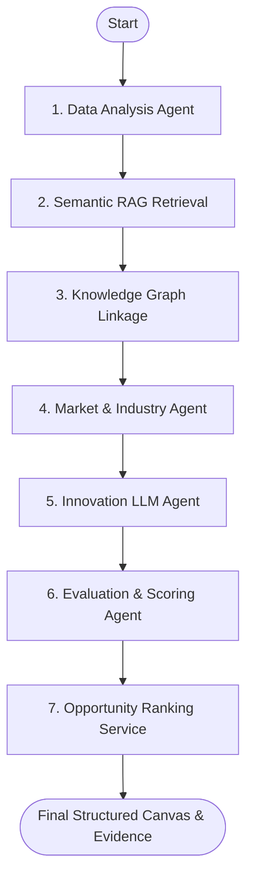

# INTRACAPITAL - AI Venture Intelligence

> Discover Businesses Hidden Inside Businesses.

INTRACAPITAL is an autonomous, multi-step AI business opportunity discovery platform built for enterprise innovation. It evaluates underutilized company assets, logistics data, facilities reports, and customer feedback to generate, score, and validate high-fidelity new venture ideas, SaaS models, or operational optimizations.

The application leverages local vector embeddings, a graph-based relational database, collaborative agent reasoning, and interactive human-in-the-loop scoring.

---

## 1. System Architecture

INTRACAPITAL utilizes a structured sequential routing pipeline to evaluate company assets and generate venture opportunities.

### LangGraph Workflow Path



1. **Data Analysis Agent**: Parses raw company assets, identifying signals, operational anomalies, and customer complaints.
2. **RAG Retrieval**: Conducts semantic vector indexing and top-K search queries against document chunks.
3. **Knowledge Graph Analysis**: Maps relationships and dependencies between assets, departments, and technologies.
4. **Market & Industry Agent**: Injects market report metrics or flags assumptions as AI hypotheses where external validation is absent.
5. **Innovation Agent**: Leverages LLM reasoning to outline unique venture ideas, target customers, and GTM strategies.
6. **Evaluation Agent**: Scores opportunities across 5 key strategic dimensions (Market Potential, Feasibility, Strategic Fit, Asset Reusability, Confidence).
7. **Opportunity Ranking**: Commits generated profiles to the database and displays Canvas layouts.

---

## 2. Technology Stack

* **Frontend**: React (TypeScript), Tailwind CSS v4, Framer Motion (micro-animations), Recharts (shape radars and breakdown charts).
* **Backend API**: FastAPI (Python 3.11+), Uvicorn.
* **Vector Database**: Qdrant *(local in-memory client or containerized cluster)*.
* **Knowledge Graph**: Neo4j *(local memory-simulation client or bolt-driver cluster)*.
* **Local Inference**: IBM Granite (3-dense:8b) via Ollama.
* **Database Registry**: SQLite via SQLAlchemy ORM.

---

## 3. Local Development Setup (Host OS)

To run the frontend and backend directly on your local system, follow these commands.

### Prerequisites
* Python 3.11+ installed.
* Node.js (v18+) and npm installed.

### A. Backend Setup
1. Open a terminal and navigate to the backend directory:
   ```bash
   cd backend
   ```
2. Create and activate a Python virtual environment:
   ```bash
   python -m venv .venv
   # Windows:
   .venv\Scripts\activate
   # Linux/macOS:
   source .venv/bin/activate
   ```
3. Install dependencies:
   ```bash
   pip install -r requirements.txt
   ```
4. Run the FastAPI development server:
   ```bash
   python -m uvicorn app.main:app --host 0.0.0.0 --port 8000
   ```
   *The backend will be live at `http://localhost:8000`. You can inspect the Swagger interactive docs at `http://localhost:8000/docs`.*

### B. Frontend Setup
1. Open a new terminal and navigate to the frontend directory:
   ```bash
   cd frontend
   ```
2. Install npm dependencies:
   ```bash
   npm install
   ```
3. Run the Vite development server:
   ```bash
   npm run dev -- --host 127.0.0.1
   ```
   *The frontend dashboard will be live at `http://localhost:5173/`.*

---

## 4. Containerized Deployments (Docker Compose)

The repository comes pre-packaged with container rules for multi-service environments.

### Deploy Services
Spin up Qdrant, Neo4j, Ollama, and the FastAPI backend:
```bash
docker compose up -d
```

### Pull LLM Weights
Pull the IBM Granite weights inside the Ollama container:
```bash
docker compose exec ollama ollama pull granite3-dense:8b
```

### Port Mappings
* **Vite React Frontend**: `http://localhost:5173`
* **FastAPI Backend**: `http://localhost:8000` (Docs: `http://localhost:8000/docs`)
* **Qdrant Vector DB**: `http://localhost:6333`
* **Neo4j Graph Database**: `http://localhost:7474` (Bolt: `7687`)
* **Ollama Server**: `http://localhost:11434`

---

## 5. Key System Features

### A. One-Click Demo Mode ([LOAD DEMO COMPANY])
* Ingests local operational telemetry representing a refrigerated transport firm (**FrostLink Logistics**):
  1. Facility refrigeration logs (SCADA sensor deviations).
  2. Fleet logistics reports (ThermoKing chilling compressor audits).
  3. Real-time temperature anomalies and customer complaints.
* Runs the ingestion pipeline, processes text chunks, builds vector database indexes, links the knowledge graph, and invokes the sequential workflow to discover cold-chain innovation opportunities.

### B. Human-in-the-Loop Validator
* Displays venture shape radar charts comparing strategic coordinates.
* Provides interactive sliders to manually override Market Potential, Feasibility, Strategic Fit, Asset Reusability, and Confidence.
* Directly recalculates the overall score using the weighted scoring formula without invoking the LLM, showing the exact score delta before saving the adjustments to the SQLite database.
* Allows human operators to explicitly **Approve** or **Reject** venture cards.
