# INTRACAPITAL
> **Discover Businesses Hidden Inside Businesses.**

INTRACAPITAL is an enterprise-grade **AI Venture Discovery Engine** built for HackVerse 2.0. It is designed to mine isolated corporate assets (patents, customer feedback logs, internal research papers, operational audits, and real-time telemetry datasets) to automatically synthesize, score, and rank new business opportunities.

This application is **NOT a chatbot**; it is a batch analytical dashboard that traces the clear path from:
`Corporate Assets ➔ Data Preparation ➔ Semantic Search ➔ RAG Correlation ➔ AI Opportunity Generation ➔ Scoring & Ranking`.

---

## 🎯 Executive Overview

### The Problem
Large enterprises generate massive volumes of high-value assets (such as sensor data, custom research papers, patented technologies, and customer complaints) that remain isolated in departmental silos. Product, R&D, and logistics teams rarely communicate in real-time. As a result, companies miss multi-million dollar venture opportunities that could be launched by combining existing internal resources to solve documented customer pain points.

### The Solution
INTRACAPITAL crawls heterogeneous corporate files, extracts and normalizes textual contexts, processes time-series telemetry to detect anomalies, and builds a persistent local vector database. By running cross-domain semantic queries, it surfaces hidden links (e.g. connecting sensor temperature excursions to berry spoilage complaints, and resolving them using an internal mesh network patent). It then uses IBM Granite (via Watsonx.ai) to synthesize detailed, grounded venture business models and ranks them using a weighted score.

---

## ⚙️ Technology Stack

- **Core Logic**: Python 3.13
- **Vector Database**: ChromaDB (persistent local storage)
- **Local Embeddings**: sentence-transformers (`all-MiniLM-L6-v2` - 384 dimensions)
- **Telemetry Processing**: Pandas & NumPy (automated mathematical anomaly detection)
- **AI Intelligence**: IBM watsonx.ai SDK & IBM Granite Model (`ibm/granite-13b-instruct-v2`)
- **Dashboard Interface**: Streamlit (Premium dark-themed visual layout)
- **Charts & Visualizations**: Plotly (polar radar comparison charts & timeline line charts)
- **File Extraction**: PyPDF (PDF text mining) & Built-in file stream managers
- **Testing**: pytest & unittest

---

## 🏗️ System Architecture

```mermaid
graph TD
    A[Company Assets: Patents, PDF, CSV Logs] -->|Ingestion & Filtering| B[Data Prep: Extraction, Telemetry Anomaly detection]
    B -->|Vector Chunking| C[Knowledge Base Indexing]
    C -->|Semantic Search queries| D[RAG retrieval Context]
    D -->|Prompt Synthesis| E[IBM Watsonx / Granite Model]
    E -->|JSON Schema Output| F[Venture Opportunity Engine]
    F -->|Weighted Weights Model| G[Scoring & Ranking Processor]
    G -->|Executive Render| H[Executive Dashboard UI]
    
    style A fill:#1e293b,stroke:#475569,stroke-width:2px;
    style E fill:#4f46e5,stroke:#818cf8,stroke-width:2px,color:#fff;
    style H fill:#0f766e,stroke:#0d9488,stroke-width:2px,color:#fff;
```



---

## 🛡️ Security & Privacy Grounding

- **Git Exclusions**: The `.gitignore` is pre-configured to ensure local `.env` files, uploads, persistent `vectorstore` files, and virtual environments `.venv` are never committed to version control.
- **Zero Hallucinations**: Venture opportunities are strictly grounded in retrieved document chunks. The Business Model Canvas explicitly labels unsupported columns (like Go-To-Market and Competitive Advantage) as `⚠️ Requires validation` rather than fabricating details.
- **No API Secrets Exposure**: Credentials are exclusively loaded from the operating system environment or a `.env` file via `python-dotenv`.

---

## 🛠️ Installation & Setup

If your main drive (e.g. `C:`) is running low on disk space, follow this D-drive redirection guide to set up the environment using a secondary drive:

### 1. Create the Virtual Environment on D: Drive
Open your terminal in the repository folder and create the virtual environment on your D: drive:
```bash
python -m venv D:\intracapital_venv
```

### 2. Activate the Virtual Environment
On Windows (PowerShell):
```powershell
D:\intracapital_venv\Scripts\activate
```
*(If on macOS/Linux: `source /path/to/venv/bin/activate`)*

### 3. Install Dependencies with Redirected Cache
Set temp environment variables and point the pip download cache to your D: drive to prevent `No space left on device` errors:
```powershell
$env:TEMP='D:\temp'
$env:TMP='D:\temp'
D:\intracapital_venv\Scripts\pip install --cache-dir D:\pip_cache -r requirements.txt
```

### 4. Configure Environment Variables
Copy `.env.example` to `.env`:
```bash
copy .env.example .env
```
Update `.env` with your watsonx.ai credentials. If you do not have active credentials, leave the file blank. The engine will automatically default to **Demo Mode**.

---

## 🏃 Running the Application

### Executing Automated Unit Tests
Verify the installation by running pytest:
```bash
pytest
```
Or with python's built-in test module:
```bash
python -m unittest tests/test_backend.py
```

### Running the Web App Dashboard
```bash
streamlit run app.py
```

---

## 🔮 Demo Instructions (Judges' Walkthrough)

1. **Launch**: Run `streamlit run app.py` and open the local port in your browser.
2. **Setup**: Click **LOAD DEMO COMPANY** on the landing screen to populate the workspace with patents, telemetry logs, customer feedback, and internal research reports.
3. **Trigger Pipeline**: Click the large **DISCOVER HIDDEN BUSINESSES** button. Watch the step-by-step progress indicator activate (UPLOAD ➔ EXTRACT ➔ CLEAN ➔ CHUNK ➔ EMBED ➔ RAG INDEX ➔ READY).
4. **Dashboard Analysis**: Review the executive metrics showing analyzed assets and average confidence.
5. **Radar & Telemetry**: Toggle the **Radar Comparison** tab to view a Plotly polar chart comparing the 3 ventures. View the timeline charts showing real-time temperature excursions.
6. **Venture Deep Dive**: Go to the **Business Model Specification** tab. Select an opportunity to examine its grounding evidence, RAG context snippets, and mathematical score calculations.

---

## 🌐 Deployment Details

For production deployment:
- **Streamlit Community Cloud**: Add `.streamlit/secrets.toml` with the `WATSONX_*` credentials and point the main file to `app.py`.
- **Hugging Face Spaces**: Deploy using a Streamlit SDK template. Bind watsonx environment variables in the repository settings page.
- **Docker Deployment**: Build using a python base image, copy source directories, expose port `8501`, and run `streamlit run app.py --server.port 8501`.

---

## ⚖️ Ethics, Limitations & Future Scope

### Ethics
- **Data Governance**: Ingested files are stored in a local, volatile directory and vector collections are cached on-disk, ensuring corporate knowledge never leaves the enterprise boundary.
- **Explainable Scoring**: All scores are computed using transparent weighted criteria with detailed explanations, preventing opaque or biased decision-making.

### Limitations
- **File Formats**: Current support is limited to TXT, PDF, and CSV files.
- **Context Length**: The context retrieved by RAG is subject to LLM prompt token limits.
- **Batch Processing**: Telemetry analysis is performed in batches rather than continuous streams.

### Future Scope
- **Multi-Modal Matching**: Correlating technical engineering blueprints, CAD files, and acoustic machine hums directly to predict parts failure.
- **Real-Time Streaming**: Attaching Kafka streams directly to the ingestion pipeline to continuously flag ventures as new anomalies occur.
- **Human-in-the-Loop Feedback**: Letting executives refine venture details, feeding adjustments back into the Granite model to improve confidence.
